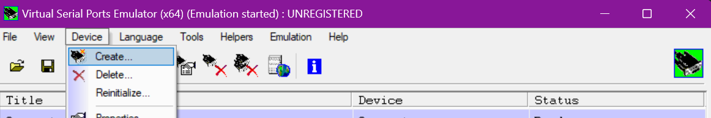
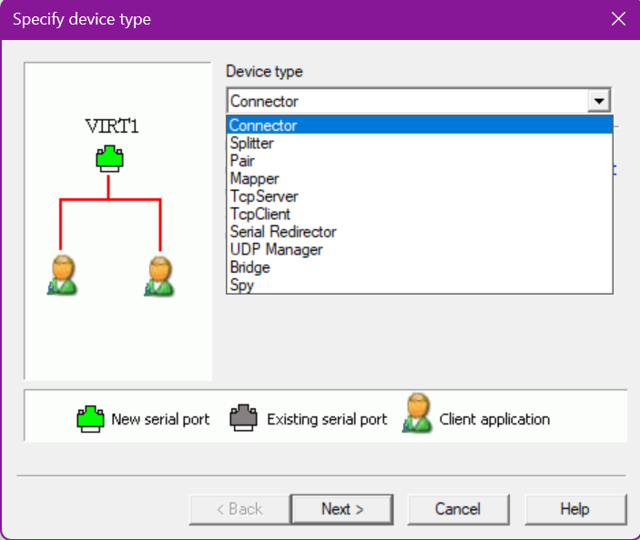
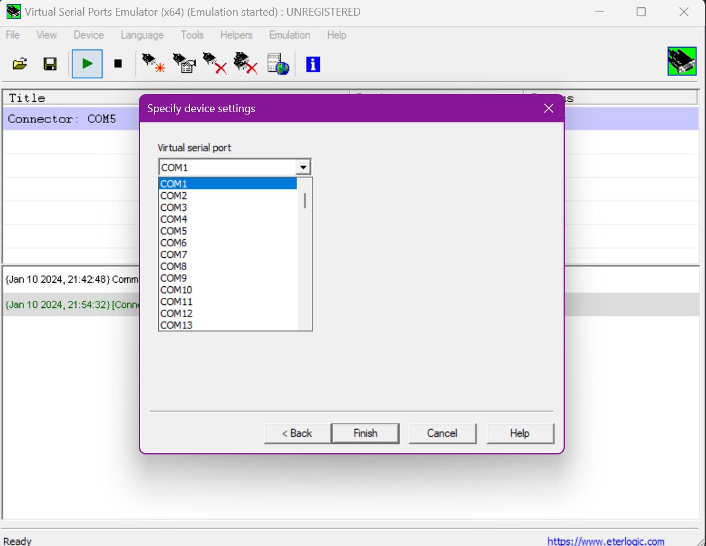
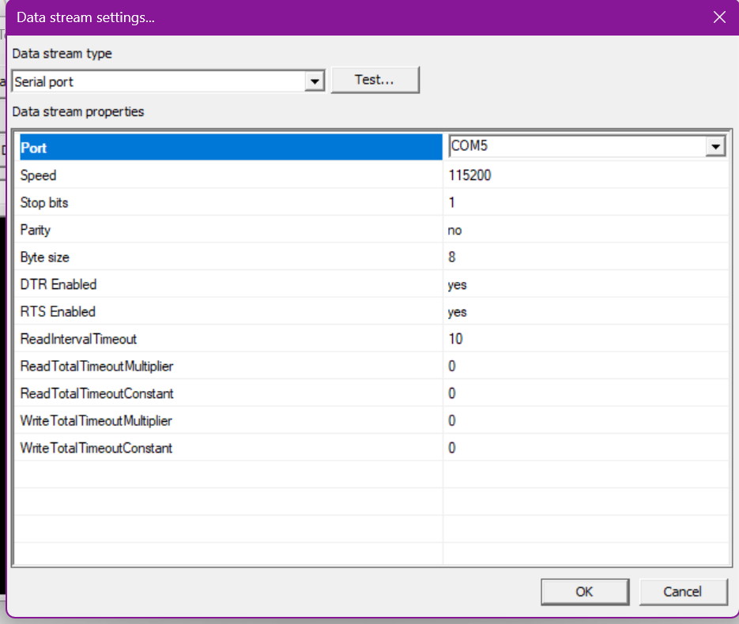
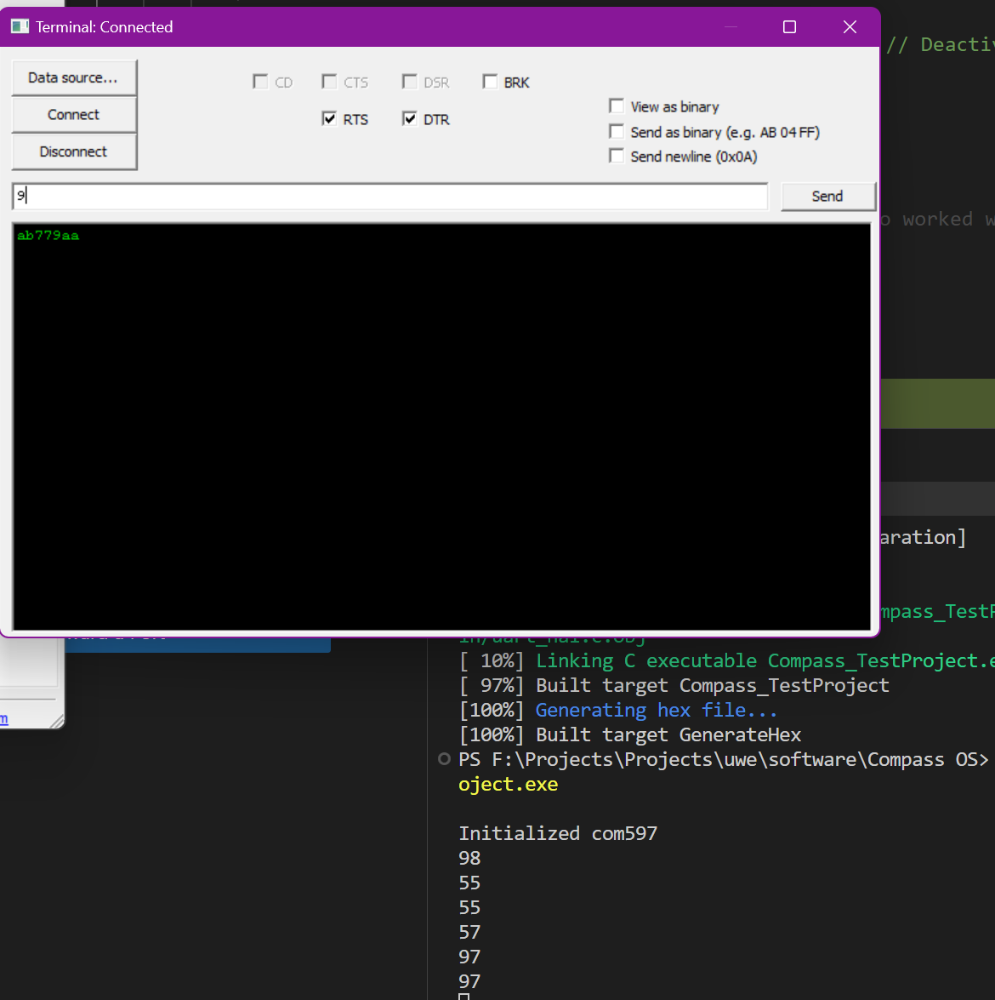

# UART Communication in Windows with VSPE

## Introduction

VSPE(Virtual Serial port Emulator) is one of the few tools that allows developer to create/debug/test application that receives/transmits data by creating a virtual device within the machine itself.

In our case of use, VSPE allows us the luxury to test compass services and programs within our machine without the need of additional microcontrollers. In this

Further details about VSPE can be found at its official [website](https://eterlogic.com/Products.VSPE.html).

## Setting up Virtual UART with VSPE

VSPE can be downloaded for both 32-bit and 64-bit windows through the official [website](https://eterlogic.com/Products.VSPE.html).

As of the time of this documentation, we can use VSPE without the need of license and registration. Please check official website for up to date information.

To setup the virtual port with VSPE, please follow the steps below:

1. Download and setup VSPE in your machine.
2. Open VSPE, you will see various menus within the menu bar. Click on `Device`, and then on `Create``.

3. VSPE allows us to simulate wide range of devices. To create UART port select `Connector` under device type, then click `Next`.

4. Select the virtual port and click `Finish`.

Following the steps above creates a virtual port within your system. This port can be used to establish Uart communication. 

To simulate a virtual client that is connected to port, please follow the steps below:

1. Click on `Tools` and then `Terminal`.
2. Once terminal window opens, click on `Data Source` and set `Data Stream Type` to serial port. Please update the configuration as per the requirement.

3. Click on `OK` once the serial port is tested. 
4. Click on `Connect` button.

Now you will be able to transmit data between compass and your virtual terminal.
The image below shows the data being sent by VSPE being displayed in terminal on which compass is running.

